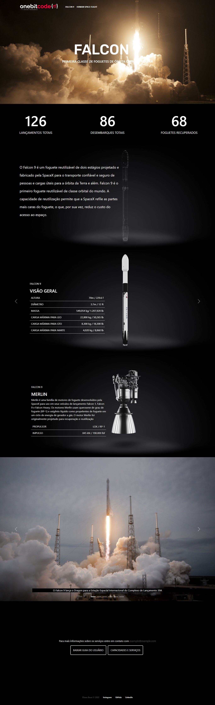

PT-BR:
<h3>Página feita utilizando: HTML, SCSS, BOOTSTRAP e LIB</h3>
  
Exercício final do módulo de Bootstrap - Curso OneBitCode

  
Link da LIB utilizada: https://michalsnik.github.io/aos/

  
Além de utilizar animações, também foi realizado a responsividade da página

  
OBS:Primeiro projeto relativamente grande que utilizo SCSS e LIB... Sugestões e melhorias são sempre bem-vindas!

  
Screenshots das previews abaixo:

  
EN:
<h3>This page was create using: HTML, SCSS, BOOTSTRAP and LIB</h3>

Bootstrap's module final exercise - OneBitCode Course

LIB link: https://michalsnik.github.io/aos/

Beside using some animations, we did the responsive as well

PS.:It was my first "big" project using SCSS and a LIB... Suggestions and improvements are always welcome!

Preview screenshots above:

  

    
    
    
  

